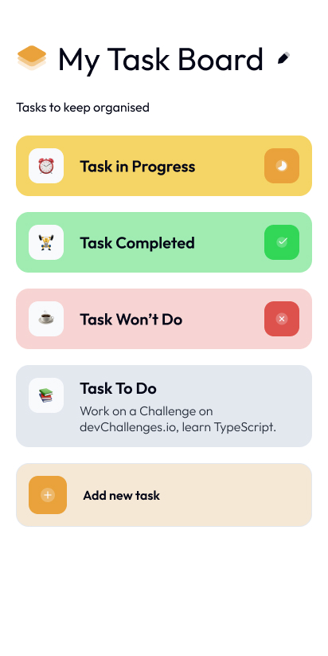

# My Task Board

Welcome to **My Task Board** project. This is a task management tool that helps users stay organized and manage tasks efficiently. The app allows you to create, update, and delete tasks, and categorize them based on their status.

## Features

- Add new tasks
- Edit existing tasks
- Delete tasks
- Categorize tasks into:
  - **In Progress**
  - **Completed**
  - **Won't Do**
- Emoji options for easy task identification

## Technologies Used

- **HTML/CSS/JavaScript** for the front-end
- **Node.js** for the back-end
- **Express** - Node.js framework used to handle HTTP requests.
- **PostgreSQL** for the database
- **Fetch API** for handling HTTP requests

## How to Run the Project

### Prerequisites

Make sure you have **Node.js** and **PostgreSQL** installed on your machine.

### 1. Clone the Repository

Clone the project to your local machine:

```bash
git clone https://github.com/your-username/my-task-board.git
```

### 2. Install Dependencies

Navigate into your project folder and install the required dependencies:

```bash
cd my-task-board
npm install
```

### 3. Set Up the Database

Make sure your PostgreSQL database is set up. You need to create a tasks table where your tasks will be stored.

```bash
CREATE TABLE tasks (
  id SERIAL PRIMARY KEY,
  name TEXT NOT NULL,
  description TEXT,
  emoji TEXT,
  status TEXT
);
```

### 3. Install `nodemon` Globally (If Not Installed)

To run the server with automatic restarts, install nodemon globally. You can do this with the following command:

```bash
npm install -g nodemon
```

Alternatively, you can install it as a development dependency if you prefer:

```bash
npm install --save-dev nodemon

```

### 5. Start the Server

The server is located inside the `server` folder. To run the back-end server, navigate to the `server` directory and use `nodemon` for automatic restarts:

```bash
cd server
nodemon app.js

```

The server will run on `http://localhost:7000`.

### Additional Notes

- The backend is set to run on port `7000` by default. If you want to change it, just update the `PORT` variable in `server/app.js`.
- If you encounter any issues during development or need to reset the database, feel free to ask for assistance!

### Contributing

We welcome contributions! If you'd like to improve the project, follow these steps:

1. Fork the repository
2. Create a new branch (`git checkout -b feature-name`)
3. Make your changes
4. Commit your changes (`git commit -am 'Add new feature'`)
5. Push to the branch (`git push origin feature-name`)
6. Create a pull request

## License

This project is open source and available under the MIT License.

## Screenshot

<picture>
  <!-- For screens wider than 768px (typically desktop) -->
  <source media="(min-width: 768px)" srcset="design/Desktop_1350px.jpg">

  <!-- For smaller screens (typically mobile) -->
  
</picture>
## 🤝 Connect with Me

- [LinkedIn](https://www.linkedin.com/in/firo-guteta/)
- [X(Twitter)](https://x.com/FiroGute492)

Coded by [Firomsa Guteta](https://github.com/firogute) | Challenge by devChallenges.io
